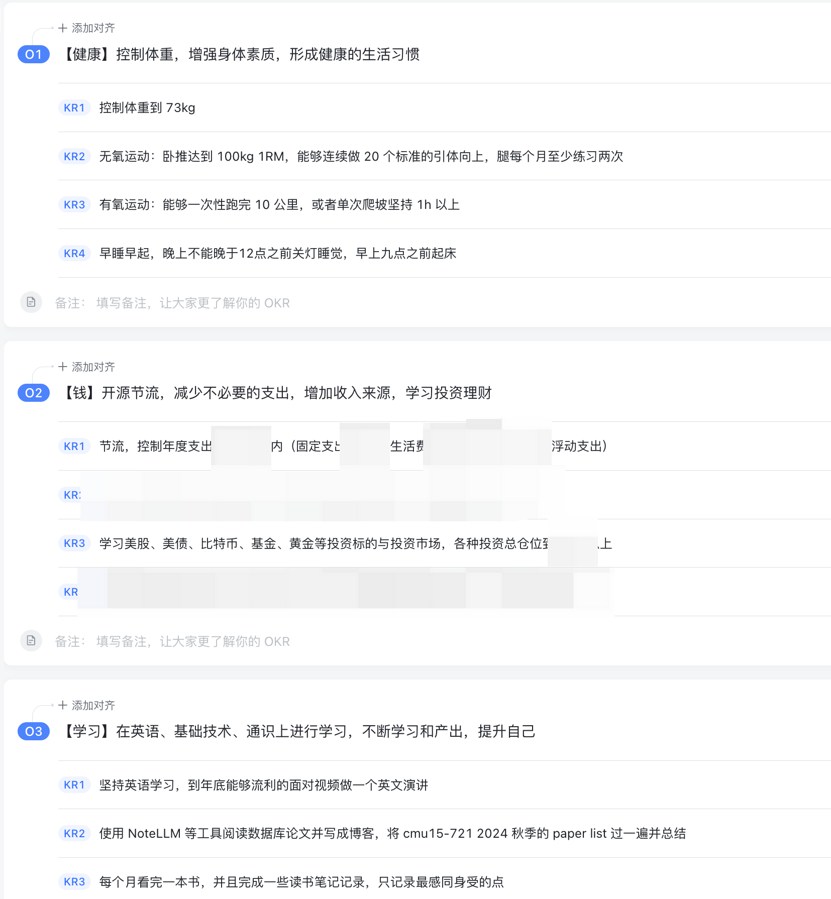

> 丢掉幻想，开始斗争

一年又一年，竟然已经到了 2025 年底了，今年自己的状态感觉整体是很不错的，生活工作教会了我不少事情，就好像打怪升级一样，感受到自己的心态不断地变稳，虽然仍然有很多需要努力变好的地方，但自己的人生状态确实在不断变好，能够慢慢处理好自己的生活，自己的确在逐步变成一个更好的人了吧！

# 年度目标复盘

感激自己每年都有定年度目标的习惯，今年猛的回头一看去年立下的 flag，竟然大部分都完成了，感到非常开心。下面逐条来梳理下

* O1：保持健康仍然会是我人生中最重要的目标，没有之一

  * 体重到年末的时候是 76 kg，没有达到目标，但是好的一个方面是保持住了并没有继续反弹，明年需要继续加油
    * 希望明年减体脂之后能把肌肉线条变得更加明显，现在到达了一个初步有线条的状态
  
  * 自己今年卧推竟然真的达到了 100kg，非常开心；自重引体向上虽然不能够一次做到 20个，但是一次训练中能够做 接近 50个
  
    * 有氧运动，今年完成了 15 公里的目标！明显感觉到自己在心肺的增强，非常感谢
    * 年末的时候脚伤了，于是搁置了两个月，运动最重要的并不是取得多少进步，而是**千万不要受伤！**
    * 早睡早起…… 自己大部分时间仍然是在熬夜，不过在最后两个月以来不知道为什么突然开始能坚持早睡早起，并保证自己每年七个半小时以上的睡眠，睡眠状态确实不错，希望明年能继续保持
  
    越来越觉得运动是一件非常好的事情。
  
    坚持运动能够每隔一段时间看到自己的进步，长期运动后让自己的身材变好，还能作为自己浪费时间的一种心理赎罪券……
* O2：钱，处理好自己和钱的关系

  * 节流：这个目标没有完全达成，不过自己又坚持记了一年账，确实超支预算了，明年需要继续坚定的执行预算制度
  * 投资
    * 今年是自己投资开始实践的第一年，初步学习了解了绝大多数投资标的和市场，并今年自己逐步把所有的子弹都打出去了
    * 由于本金很少，不看绝对收益的话，只看收益率的话，得益于今年A股的行情，A 股的年化收益率在 20%+ 多，美股的收益率有 40%+，现在看都只是浮盈，希望长期能有一个更好的结果吧！
    * 投资确实是一件很难的事情，但是也是一件很有趣的事情，绝大多数事情你是无法控制和预测的，慢慢修炼投资的心态吧！
    * 明年也要继续钻研投资，更后悔的一点是自己应该更早一些开始接触投资
  * 今年得益于投资市场的行情，财务目标实际上已经超出预期了（虽然仍然是 人行道的方式

* O3：学习

  * 今年大概看了20+本书，保持阅读的习惯吧！[今年的阅读笔记放在这里了](https://tanweime.com/2024/12/29/2025%E9%98%85%E8%AF%BB%E7%AC%94%E8%AE%B0/)。
  * 英文的学习得益于公司给报名的一个外教课，每周和外教交流一个小时，发现自己也是能够和英文母语的人交流的，虽然自己的发音和词汇量还不是那么好，但是有进步，加油！自己需要再努力提升提升

* adhoc：bonus

  * 自己今年开始自己做饭了，处理好自己和食物的关系也非常重要，会让我有一种踏实的感觉，让我有一种真的在生活的感觉

越来越觉得要找到人生中真正重要的东西，并不断践行，当前我认为就是上面这些点：

* 个人的健康
  * 也包括心理健康，一个强大稳稳的内核
* 钱
  * 处理好自己和钱的关系，需要正确梳理自己在财务方面的目标
* 持续学习
* 人际关系
  * 就像阿德勒心理学说的那样，人所有的烦恼都来自于人际关系，所以处理好人际关系非常重要

今年也去了不少地方，哈尔滨、大连、惠州、杭州、长沙、恩施、盐城、东京、北京、南京、无锡、萍乡、大连，去了十四个城市。希望明年能够解锁更多城市和地点吧。

# 反思

* 虽然整体看自己达成了不少目标，但是在每一天的时间里，自己仍然有不少时间浪费在短视频和游戏当中，需要更明确的控制自己的时间消耗
* 在业余尝试做某些事情的时候容易浅尝辄止，每件事情需要专注地投入更多
* 需要更多在思维/更长期的战略层面做一些思考，不要在战术以及战斗层面纠结太多，要持续保持学习，保持空杯的心态

